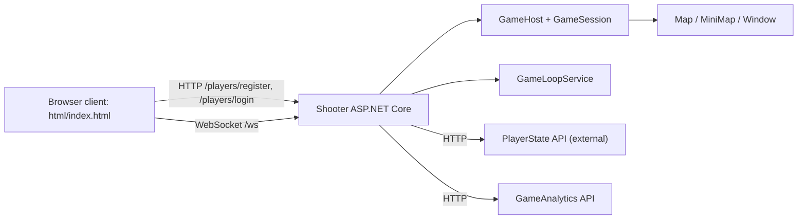
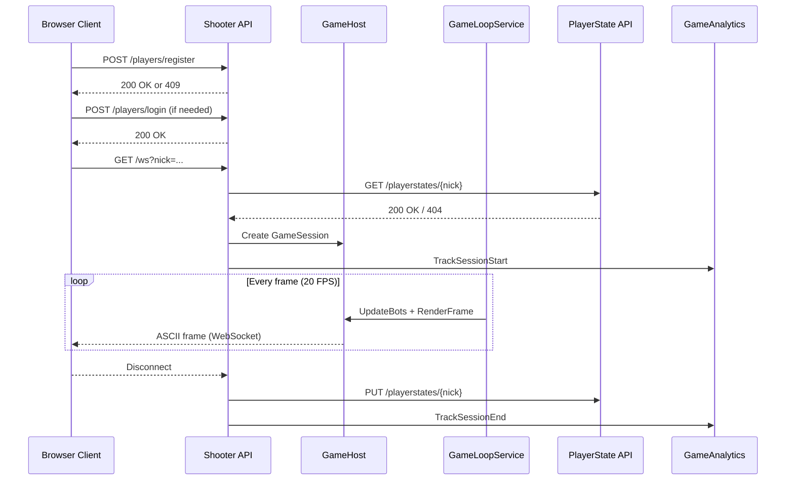
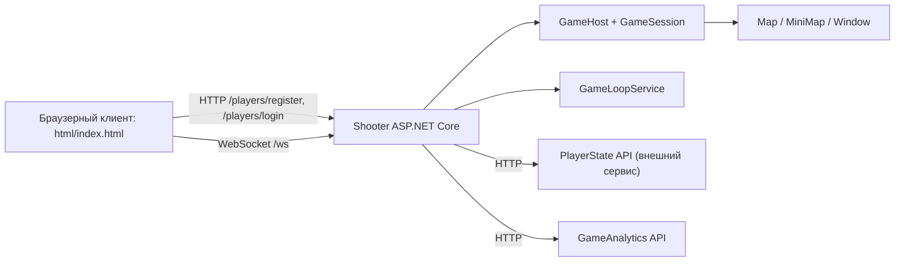

# Shooter — ASCII Multiplayer FPS

Real‑time ASCII shooter with a shared map, WebSocket sessions, local bot AI, and optional analytics/state services.

---

## English

### Features
- WebSocket multiplayer with a shared world (`GameHost` + `GameLoopService`)
- ASCII raycasting renderer + minimap
- Dynamic resizing + client zoom
- Bot mode (press `9` to replace players with bots)
- Optional player state persistence via external API
- Optional GameAnalytics events (session start/end, kills)

### Tech Stack
- Backend: C# / .NET 8, ASP.NET Core minimal APIs, WebSockets
- Runtime services: `BackgroundService`, hosted services, `System.Threading.Channels`
- Concurrency: `ConcurrentDictionary`, async/await, task-based parallelism
- Integrations: `HttpClientFactory`, PlayerState API, GameAnalytics REST API
- Frontend: HTML + CSS + vanilla JavaScript, Fetch API, WebSocket client

### Demo


### Architecture


### Backend Architecture & Modules
- `Program.cs` — minimal API, DI registration, WebSocket endpoint
- `Server/GameHost` — orchestrates sessions, snapshots, bots, spawn and combat
- `Server/GameSession` — per‑connection state, input handling, view scaling
- `Server/GameLoopService` — background 20 FPS loop and frame delivery
- `Game/*` — raycasting renderer, map generation, frame buffer/overlays
- `Repositories/PlayersRepository` — in‑memory player registry
- `Services/*` — PlayerState API + GameAnalytics integrations

### Data & API Flow
- `POST /players/register`, `POST /players/login` → validate and register players in repo
- `GET /ws?nick=...` → WebSocket session, load state, spawn and run loop
- `PlayerStateApiClient` → `GET/PUT /playerstates/{nickname}` for persistence
- `GameAnalyticsService` → event queue and send to GameAnalytics (optional)

### Design Patterns Used
- Dependency Injection (registration via `builder.Services`)
- Repository pattern (`PlayersRepository`)
- Background/Hosted Service (`GameLoopService`, `GameAnalyticsService`)
- Producer–Consumer (event queue via `Channel<T>`)
- HttpClient Factory (external HTTP clients)
- Singleton‑like lifetime (host/repo as `AddSingleton`)
- State‑based bot AI (targets, decisions, cooldowns)
- Thread‑safe collections (`ConcurrentDictionary`) + render lock

### Backend Experience Highlights
- Designed a real‑time WebSocket backend with fixed‑step game loop (20 FPS).
- Built session orchestration and in‑memory state with thread‑safe registries.
- Implemented external service integration via HttpClient factory (state + analytics).
- Added resilience: tolerant to network disconnects and external API failures.
- Modeled data contracts for persistence and analytics events.

### Scalability & Performance Notes
- Fixed timestep loop at 20 FPS to keep simulation deterministic and stable.
- Parallel frame build per session (`Task.WhenAll`) to use multiple cores.
- Per‑session render lock isolates frame construction from input updates.
- Snapshot‑based multiplayer sync reduces contention and write‑amplification.
- ASCII rendering and binary WebSocket frames keep bandwidth low.

### Future Improvements (backend‑oriented)
- Replace in‑memory repository with persistent storage (e.g., Redis/DB).
- Introduce matchmaking/lobbies and multiple game instances.
- Add rate limiting and auth for public deployment.
- Move analytics and persistence to background queues with retries.
- Add structured logging/metrics for FPS, session counts, and WS latency.

### Sequence: Session Flow


### Session Lifecycle (backend)
1. Client calls `POST /players/register` with `{ "nickname": "..." }`.
2. If name already exists, client falls back to `POST /players/login`.
3. Client opens `GET /ws?nick=...` WebSocket.
4. Server validates player, loads persisted state (optional) or picks random spawn.
5. `GameHost` creates a `GameSession`, tracks snapshots, starts analytics session.
6. `GameSession` processes input, updates `Player`, and publishes snapshots.
7. `GameLoopService` renders frames at 20 FPS and sends ASCII frames to clients.
8. On disconnect/kill: state is saved, analytics session ends, in‑memory data is cleaned.

### WebSocket Protocol
- Client → server: `KeyboardEvent.code` strings (`KeyW`, `KeyA`, `KeyS`, `KeyD`, `Digit1`, `Digit2`, `Digit9`, `Space`, `Escape`, `Enter`).
- Resize handshake: `RESIZE {cols} {rows} {scale}` (sent on window/zoom changes).
- Server → client: UTF‑8 ASCII frame (sent as binary WebSocket message).

### Rendering Pipeline
- `Map.Update()` → raycast walls, compute depth buffer and column depths.
- `SpriteMetrics` selects enemy sprite LOD based on distance and view scale.
- `Window` draws enemies, names, minimap overlay, weapon sprite, and help.
- `Window.ToText()` builds a text frame for WebSocket delivery.

### Concurrency & Resilience
- Thread‑safe registries: sessions/snapshots/bots use `ConcurrentDictionary`.
- Render lock per session avoids tearing between input and frame build.
- Frame rendering runs in parallel per session (`Task.WhenAll`).
- WebSocket send exceptions are swallowed to avoid breaking the loop.
- Persistence errors are ignored on disconnect; analytics errors are logged.

### Data Models
- `Player` — mutable player state + movement logic.
- `PlayerSnapshot` — immutable state snapshot for multiplayer sync.
- `PlayerState` — DTO for persistence API.
- `BotState` — bot AI state with target tracking and timers.

### Configuration & External Services
- `PlayerStateApi:BaseUrl` — external persistence API (default `http://localhost:51360`).
- `GameAnalytics` — optional analytics with HMAC auth (user‑secrets).
- Web server uses ASP.NET Core minimal APIs + WebSockets.

### Project Structure
```
Shooter/
  Game/            core rendering, map, minimap
  Server/          sessions, host, loop, bots
  Models/          player and snapshot DTOs
  Repositories/    in‑memory player registry
  Services/        analytics + player state API client
  html/            browser client
```

### Run
1. `dotnet run --project Shooter/Shooter.csproj`
2. Open `http://localhost:51350`
3. Enter a nickname and join

### Player State Service (optional)
The game expects an external minimal API for persistence (PlayerState Service):
- Purpose: store/load last position and angle by `nickname`
- Tech: .NET 8 + ASP.NET Core minimal API, EF Core 8, SQLite
- Default URL: `http://localhost:51360`
- Configure in `appsettings.json` under `PlayerStateApi:BaseUrl`
- Service DB: SQLite file created at startup (default `Data Source=playerstate.db`)

#### API (PlayerState Service)
- `GET /playerstates/{nickname}` → `200` JSON, `404` if missing, `400` if nickname empty
- `PUT /playerstates/{nickname}` → create/update, `200` JSON, `400` if nickname empty
- Error format: `{ "error": "Nickname is required" }`

Example response:
```json
{
  "nickname": "Alex",
  "playerX": 10.5,
  "playerY": -3.2,
  "playerA": 1.57,
  "updatedAt": "2026-02-05T12:34:56.789Z"
}
```

Quick start:
```bash
dotnet run --project PlayerStateServiceApi/PlayerStateServiceApi.csproj
```

### GameAnalytics (optional)
Set secrets and enable:
```bash
dotnet user-secrets set "GameAnalytics:GameKey" "<YOUR_GAME_KEY>"
dotnet user-secrets set "GameAnalytics:SecretKey" "<YOUR_SECRET_KEY>"
dotnet user-secrets set "GameAnalytics:Enabled" "true"
```
Optional (production endpoint):
```bash
dotnet user-secrets set "GameAnalytics:BaseUrl" "https://api.gameanalytics.com"
```

### Controls
- `W/A/S/D` — move/turn
- `M` — toggle minimap
- `1` — pistol
- `2` — shotgun
- `9` — bot mode
- `Space` — shoot
- `Enter` — toggle help
- `Esc` — exit
- `[` / `]` — zoom out / in
- `0` — reset zoom

---

## Русский

### Возможности
- Мультиплеер через WebSocket, общий мир (`GameHost` + `GameLoopService`)
- ASCII‑рендерер (raycasting) + миникарта
- Динамическое изменение размеров + масштабирование клиента
- Режим ботов (клавиша `9` заменяет игроков ботами)
- Опциональное сохранение состояния через внешний API
- Опциональная интеграция GameAnalytics (сессии/убийства)

### Стек технологий
- Бэкенд: C# / .NET 8, ASP.NET Core minimal API, WebSockets
- Фоновые сервисы: `BackgroundService`, hosted services, `System.Threading.Channels`
- Конкурентность: `ConcurrentDictionary`, async/await, параллелизм на `Task`
- Интеграции: `HttpClientFactory`, PlayerState API, GameAnalytics REST API
- Фронтенд: HTML + CSS + vanilla JavaScript, Fetch API, WebSocket клиент

### Демонстрация


### Архитектура


### Архитектура бэкенда и модули
- `Program.cs` — минимальный API, DI‑регистрация и WebSocket endpoint
- `Server/GameHost` — оркестратор сессий, снапшотов, ботов, спавна и боя
- `Server/GameSession` — состояние на одно подключение, ввод и масштабирование
- `Server/GameLoopService` — фоновой игровой цикл 20 FPS и рендер кадра
- `Game/*` — raycasting‑рендер, генерация карты, буфер кадра/оверлеи
- `Repositories/PlayersRepository` — in‑memory реестр игроков
- `Services/*` — интеграции PlayerState API + GameAnalytics

### Работа с API и логикой данных
- `POST /players/register`, `POST /players/login` → регистрация игроков и проверка уникальности
- `GET /ws?nick=...` → WebSocket сессия, загрузка состояния, спавн и игровой цикл
- `PlayerStateApiClient` → `GET/PUT /playerstates/{nickname}` для сохранения позиции
- `GameAnalyticsService` → очередь событий и отправка аналитики (опционально)

### Используемые паттерны
- Dependency Injection (регистрация через `builder.Services`)
- Repository pattern (`PlayersRepository`)
- Background/Hosted Service (`GameLoopService`, `GameAnalyticsService`)
- Producer–Consumer (очередь событий через `Channel<T>`)
- HttpClient Factory (внешние HTTP клиенты)
- Singleton‑like lifetime (host/репозиторий как `AddSingleton`)
- State‑based bot AI (цели, решения, cooldowns)
- Потокобезопасные коллекции (`ConcurrentDictionary`) + лок на рендер

### Backend Experience Highlights
- Реализован WebSocket‑backend с фиксированным игровым циклом (20 FPS).
- Спроектирована оркестрация сессий и in‑memory состояние с потокобезопасностью.
- Интеграции с внешними сервисами через HttpClient factory (state + analytics).
- Устойчивость к обрывам соединения и ошибкам внешних API.
- Моделирование контрактов данных для персистенции и аналитики.

### Масштабирование и производительность
- Фиксированный шаг 20 FPS для стабильной симуляции.
- Параллельный рендер по сессиям (`Task.WhenAll`) — использование ядер CPU.
- Лок рендера на сессию защищает кадр от гонок с вводом.
- Снапшоты для синхронизации снижают contention.
- ASCII‑кадры и binary WebSocket экономят трафик.

### Потенциальные улучшения (backend)
- Замена in‑memory репозитория на постоянное хранилище (Redis/DB).
- Матчмейкинг/лобби и несколько игровых инстансов.
- Rate limiting и аутентификация для публичного запуска.
- Фоновая очередь с ретраями для аналитики и персистенции.
- Метрики и структурные логи (FPS, число сессий, задержки WS).

### Последовательность: поток сессии


### Жизненный цикл сессии (бэкенд)
1. Клиент вызывает `POST /players/register` с `{ "nickname": "..." }`.
2. Если ник уже занят — делает `POST /players/login`.
3. Клиент открывает `GET /ws?nick=...` WebSocket.
4. Сервер валидирует игрока, загружает состояние (опц.) или выдаёт случайный спавн.
5. `GameHost` создаёт `GameSession`, фиксирует снапшоты, стартует аналитику.
6. `GameSession` принимает ввод, обновляет `Player`, публикует снапшоты.
7. `GameLoopService` рендерит кадры на 20 FPS и отправляет ASCII клиентам.
8. На разрыв/смерть: сохранение состояния, закрытие сессии, чистка in‑memory.

### WebSocket протокол
- Клиент → сервер: строки `KeyboardEvent.code` (`KeyW`, `KeyA`, `KeyS`, `KeyD`, `Digit1`, `Digit2`, `Digit9`, `Space`, `Escape`, `Enter`).
- Изменение размера: `RESIZE {cols} {rows} {scale}`.
- Сервер → клиент: UTF‑8 ASCII‑кадр (binary WebSocket).

### Рендеринг кадра
- `Map.Update()` → raycasting стен, depth buffer и глубины колонок.
- `SpriteMetrics` выбирает LOD‑спрайт по дистанции и масштабу.
- `Window` рисует врагов, имена, миникарту, оружие и подсказки.
- `Window.ToText()` собирает текстовый кадр для WebSocket.

### Потоки, конкурентность и устойчивость
- Реестры сессий/снапшотов/ботов — `ConcurrentDictionary`.
- Лок на рендер per‑session для согласованности кадра.
- Рендер в параллели для всех сессий (`Task.WhenAll`).
- Ошибки WebSocket не ломают цикл.
- Ошибки персистенции глушатся при disconnect; ошибки аналитики логируются.

### Модели данных
- `Player` — состояние игрока + движение.
- `PlayerSnapshot` — immutable снимок для синхронизации.
- `PlayerState` — DTO для API сохранения.
- `BotState` — состояние бота и таймеры.

### Конфигурация и внешние сервисы
- `PlayerStateApi:BaseUrl` — внешний сервис сохранения (по умолчанию `http://localhost:51360`).
- `GameAnalytics` — опциональная аналитика с HMAC (user‑secrets).
- Сервер — ASP.NET Core minimal API + WebSockets.

### Структура проекта
```
Shooter/
  Game/            рендеринг, карта, миникарта
  Server/          сессии, хост, игровой цикл, боты
  Models/          модели и снимки игроков
  Repositories/    in‑memory репозиторий игроков
  Services/        аналитика + клиент API состояния
  html/            браузерный клиент
```

### Запуск
1. `dotnet run --project Shooter/Shooter.csproj`
2. Открыть `http://localhost:51350`
3. Ввести ник и войти

### Сервис состояния (опционально)
Для сохранения состояния используется внешний minimal API (PlayerState Service):
- Назначение: хранение/выдача последней позиции и угла по `nickname`
- Технологии: .NET 8 + ASP.NET Core minimal API, EF Core 8, SQLite
- URL по умолчанию: `http://localhost:51360`
- Настройка в `appsettings.json` → `PlayerStateApi:BaseUrl`
- БД сервиса: SQLite‑файл создается при старте (по умолчанию `Data Source=playerstate.db`)

#### API (PlayerState Service)
- `GET /playerstates/{nickname}` → `200` JSON, `404` если нет записи, `400` если ник пустой
- `PUT /playerstates/{nickname}` → создать/обновить, `200` JSON, `400` если ник пустой
- Формат ошибки: `{ "error": "Nickname is required" }`

Пример ответа:
```json
{
  "nickname": "Alex",
  "playerX": 10.5,
  "playerY": -3.2,
  "playerA": 1.57,
  "updatedAt": "2026-02-05T12:34:56.789Z"
}
```

Быстрый старт:
```bash
dotnet run --project PlayerStateServiceApi/PlayerStateServiceApi.csproj
```

### GameAnalytics (опционально)
Секреты и включение:
```bash
dotnet user-secrets set "GameAnalytics:GameKey" "<YOUR_GAME_KEY>"
dotnet user-secrets set "GameAnalytics:SecretKey" "<YOUR_SECRET_KEY>"
dotnet user-secrets set "GameAnalytics:Enabled" "true"
```
Для продакшена:
```bash
dotnet user-secrets set "GameAnalytics:BaseUrl" "https://api.gameanalytics.com"
```

### Управление
- `W/A/S/D` — движение/поворот
- `M` — миникарта
- `1` — пистолет
- `2` — дробовик
- `9` — режим ботов
- `Space` — выстрел
- `Enter` — скрыть/показать помощь
- `Esc` — выход
- `[` / `]` — масштаб
- `0` — сброс масштаба
